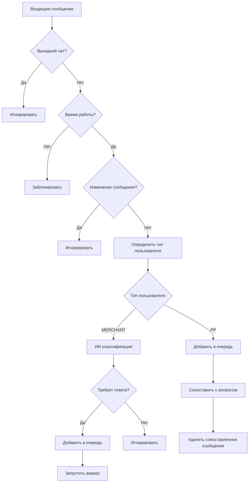

# 📋 PinokIO - Микросервис обработки сообщений

### 🔑 Ключевые возможности

- 🤖 **ИИ-классификация** сообщений на предмет необходимости ответа
- 📊 **Двухуровневая система очередей** (краткосрочная + долгосрочная)
- ⏰ **Автоматические напоминания** о висящих сообщениях
- 🔗 **Умное сопоставление** ответов операторов с вопросами клиентов
- 📈 **Мониторинг тишины** в чатах
- ⚙️ **Гибкая конфигурация** времени работы и операторов

---

## 🏗️ Архитектура проекта

### 📁 Структура файлов

```text
pinok_io/
├── 📄 app.py                    # FastAPI приложение и эндпоинты
├── ⚙️ config.py                 # Конфигурация и настройки
├── 🐳 Dockerfile               # Docker образ
├── 🐳 docker-compose.yml       # Docker Compose конфигурация
├── 📋 requirements.txt          # Python зависимости
├── 📖 functional_schema.md      # Функциональная схема (устаревшая)
├── 📖 README.md                # Эта документация
├── 📁 configs/                 # Конфигурационные файлы
│   ├── config_chats.yaml       # Настройки чатов
│   ├── config_redis.yaml       # Настройки Redis
│   └── prompts.yaml            # Промпты для ИИ
└── 📁 src/                     # Исходный код
    ├── 🧠 llm.py              # ИИ классификатор
    ├── 🔄 producer.py         # Основная логика обработки
    ├── 🗄️ redis_client.py     # Redis клиент
    └── 📁 utils/              # Утилиты
        ├── env_utils.py       # Работа с .env
        ├── httpx_utils.py     # HTTP клиент
        ├── loguru_utils.py    # Логирование
        ├── schemas_kafka.py   # Pydantic схемы
        └── time_manager.py    # Управление временем
```

### 🔧 Основные компоненты

#### 1. **FastAPI приложение** (`app.py`)

- **Эндпоинт**: `POST /process_request`
- **Авторизация**: Bearer token
- **Валидация**: Pydantic схемы
- **Lifecycle**: Управление жизненным циклом producer'а

#### 2. **Producer** (`src/producer.py`)

- **Основная логика** обработки сообщений
- **ИИ классификация** текста
- **Управление очередями** Redis
- **Мониторинг таймаутов** и напоминания

#### 3. **Redis Client** (`src/redis_client.py`)

- **Двухуровневая система очередей**:
  - Краткосрочная: `stream:chat:{chat_id}`
  - Долгосрочная: `stream:chat:{chat_id}:final`
- **Агрегация сообщений** по пользователям
- **Планировщик** для сброса просроченных серий
- **Воркеры** для обработки сообщений

#### 4. **LLM** (`src/llm.py`)

- **Классификация** сообщений (требует ответа или нет)
- **Сопоставление** ответов с вопросами
- **OpenAI API** интеграция

---

## 🚀 Быстрый старт

### 📋 Предварительные требования

- Python 3.11+
- Redis 6.0+
- Docker & Docker Compose (опционально)

### 🛠️ Установка

#### Локальная разработка

```bash
# Клонирование репозитория
cd micro_services/pinok_io

# Установка зависимостей
pip install -r requirements.txt

# Настройка переменных окружения
cp env.sample .env
# Отредактируйте .env файл с вашими настройками

# Запуск приложения
python app.py
```

#### Docker

```bash
# Сборка и запуск через Docker Compose
docker-compose up --build

# Или только сборка
docker build -t pinok_io .
```

### ⚙️ Конфигурация

#### Переменные окружения (`.env`)

```bash
# Авторизация
BEARER_TOKEN=your_secret_token

# Бот
DEFAULT_USER_ID_BOT=bot_user_id

# Kafka
KAFKA_SENDER_URL=http://kafka_sender:PORT

# LLM
LLM_URL=https://LLM:PORT/v1
LLM_API_KEY=your_openai_api_key
LLM_MODEL=<YOUR LLM MODEL>

# Мониторинг
CHECK_INTERVAL=5
```

#### Конфигурация чатов (`configs/.config_chats.yaml`)

```yaml
"00000000-00000000-00000000-00000000-00000000": # входящий чат
  input_chat_name: "G1"
  pinger:
    output_chat_id: "00000000-00000000-00000000-00000000-00000000" # чат в который отправляются сообщения
    enabled: true # ручное управление
    whitelist: ["@telegram_acc"] # сотрудники pp
    bot_enabled: true # сообщения от бота распознаются как pp (False полностью игнорируются)
    start_time: "07:00" #UTC - время начала работы
    end_time: "19:00"   #UTC - время окончания работы
    days: [mon, tue, wed, thu, fri] # рабочие дни
    redis_buffer_window: 20
    message_timeout: 40
  silencer:
    output_chat_id: "00000000-00000000-00000000-00000000-00000000" # чат в который отправляются сообщения
    enabled: true # включить мониторинг тишины
    silence_timeout: 90 
```

---

## 🏛️ Архитектурная диаграмма

```text
┌─────────────────┐    ┌─────────────────┐    ┌─────────────────┐
│   Message       │    │   PinokIO       │    │   Redis         │
│   Service       │───▶│   Microservice │───▶│   Database      │
│                 │    │                 │    │                 │
│ • Входящие      │    │ • FastAPI       │    │ • Стримы        │
│   сообщения     │    │ • Producer      │    │ • Хеши          │
│ • Авторизация   │    │ • LLM Client    │    │ • ZSets         │
└─────────────────┘    └─────────────────┘    └─────────────────┘
                                │
                                ▼
                       ┌─────────────────┐
                       │   Kafka Sender  │
                       │                 │
                       │ • Напоминания   │
                       │ • Уведомления   │
                       └─────────────────┘

┌─────────────────────────────────────────────────────────────────┐
│                    Обработка сообщений                          │
├─────────────────────────────────────────────────────────────────┤
│ 1. Получение сообщения от MS                                    │
│ 2. Проверка авторизации (Bearer token)                          │
│ 3. Валидация входящих данных                                    │
│ 4. Предварительные проверки (выходной чат, время, изменения)    │
│ 5. Определение типа пользователя (MERCHANT/PP)                  │
│ 6. ИИ классификация (для MERCHANT)                              │
│ 7. Добавление в Redis очередь                                   │
│ 8. Запуск воркера для обработки                                 │
└─────────────────────────────────────────────────────────────────┘

┌─────────────────────────────────────────────────────────────────┐
│                    Система очередей Redis                       │
├─────────────────────────────────────────────────────────────────┤
│ Краткосрочная очередь (SHORT)                                   │
│ ├── stream:chat:{chat_id}                                       │
│ ├── Буферизация сообщений от одного пользователя                │
│ ├── Окно агрегации: 20 секунд                                   │
│ └── Автоматический перенос в долгосрочную очередь               │
│                                                                 │
│ Долгосрочная очередь (LONG)                                     │
│ ├── stream:chat:{chat_id}:final                                 │
│ ├── Финальные агрегированные сообщения                          │
│ ├── Ожидание ответа от PP                                       │
│ └── Мониторинг таймаутов                                        │
└─────────────────────────────────────────────────────────────────┘
```

---

## 🔄 Логика работы

### 📥 Обработка входящих сообщений




## ИИ компоненты

#### 1. Классификатор сообщений

**Цель**: Определить требует ли сообщение ответа

**Критерии классификации**:

- 10+ слов
- Вопросы, жалобы, упоминания
- Ссылки, телефоны, email
- Временные ссылки

**Выход**: `{class: 0|1, confidence: 0.0-1.0}`

#### 2. Сопоставление ответов

**Цель**: Связать ответ оператора с вопросом клиента

**Критерии**:

- Языковая совместимость (RU/EN)
- Лексическое совпадение
- Семантическое сходство
- Временная близость

**Выход**: `{matched_message_id: int|null}`

### ⏰ Мониторинг и напоминания

#### Система таймаутов

```text
Мониторинг каждые N секунд
├── Проверка всех активных чатов
├── Возраст сообщений > таймаут?
│   ├── ДА → Отправить напоминание через Kafka
│   └── НЕТ → Продолжить мониторинг
└── Удаление обработанных сообщений
```

#### Контроль тишины в чатах

```text
Мониторинг тишины каждые N секунд
├── LONG очередь пуста?
│   ├── ДА → Проверить время последнего уведомления
│   │   ├── прошло > SILENCE_TIMEOUT → Отправить уведомление о тишине
│   │   └── Иначе → Продолжить мониторинг
│   └── НЕТ → Обновить время активности чата
```

---

## 🔌 API Reference

### POST `/process_request`

Обработка входящего сообщения от Message Service.

#### Запрос

**Headers**:

```text
Authorization: Bearer <token>
Content-Type: application/json
```

**Body** (`IncomingFromMsRequest`):

```json
{
  "messages__id": "uuid",
  "messages__chat_id": "chat_id",
  "messages__user_id": "user_id",
  "messages__username": "@username",
  "messages__date": "2025-01-15 10:30:00.000000",
  "text_histories__text": "Текст сообщения",
  "text_histories__id": "text_id",
  "messages__parent_message_id": "parent_id",
  "text_histories__change_id": "change_id"
}
```

#### Ответ

**Успешная обработка**:

```json
{
  "status": "processed",
  "reason": "message_added_to_queue"
}
```

**Игнорирование**:

```json
{
  "status": "ignored",
  "reason": "output_chat|change_message|bot_disabled|no_response_needed"
}
```

**Блокировка**:

```json
{
  "status": "blocked",
  "reason": "time_blocked"
}
```

---

## 🗄️ Redis структуры данных

### Ключи

```yaml
# Стримы
stream:chat:{chat_id}              # Краткосрочная очередь
stream:chat:{chat_id}:final        # Долгосрочная очередь

# Хеши
agg:{chat_id}                      # Буфер текущей серии
conf:chat:{chat_id}               # Конфигурация чата
metrics:chat:{chat_id}            # Метрики чата

# Сортированные множества
sched:agg                         # Планировщик дедлайнов
```

### Схема данных

#### Сообщение в стриме

```json
{
  "user_id": "user_uuid",
  "messages_id": "message_uuid", 
  "username": "username",
  "user_type": "merchant|pp",
  "text": "Текст сообщения",
  "timestamp": "1640995200.123",
  "type": "short|long"
}
```

#### Активная серия (agg:{chat_id})

```json
{
  "user_id": "user_uuid",
  "messages_id": "last_message_uuid",
  "username": "username", 
  "user_type": "merchant|pp",
  "text": "Объединенный текст",
  "start_ts": "1640995200.123",
  "last_ts": "1640995220.456",
  "count": "3"
}
```

---

## 📚 Дополнительные ресурсы

- [Функциональная схема](functional_schema.md) - детальное описание логики
- [Конфигурация Redis](configs/config_redis.yaml)
- [Промпты ИИ](configs/prompts.yaml)

---